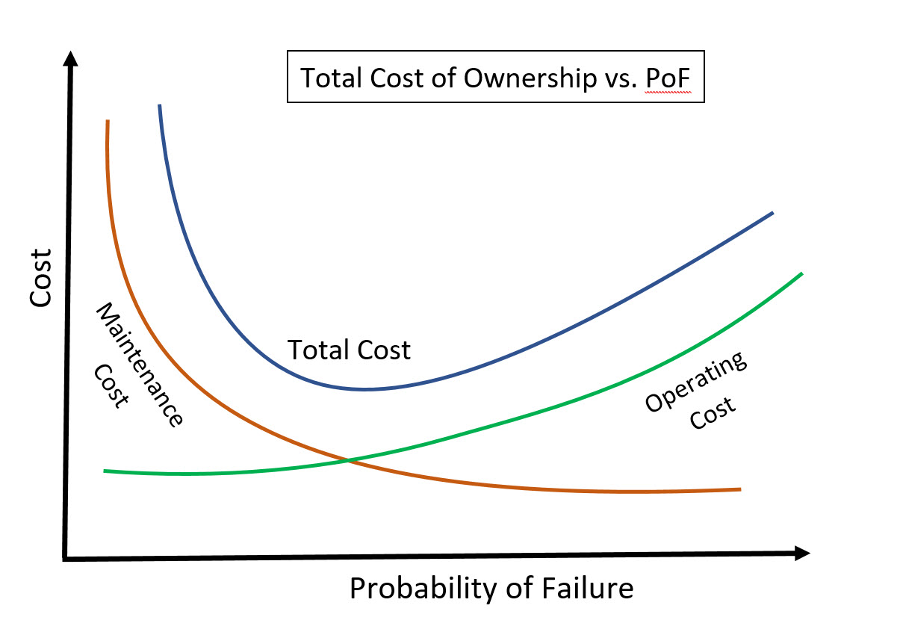

###Abstract  
With over a decade and a half since The Pipeline Safety Improvement Act of 2002 was passed (i.e. the Integrity Management Rule) and tens of millions of man-hours and tens of billions of dollars spent by operators, consultants and contractors in support of this effort, it is useful to look back and see if safety has significantly improved.  While it is impossible to prove what didn't happen because of things that were found and repaired as a result of an operator's IM program, intuitively the expectation is that measurable safety improvements would reflect in the long term incident statistics published by PHMSA[^1]. In 2006, the Government Accountability Office concluded; "As the program matures, PHMSA's performance measures should allow the agency to quantitatively demonstrate the program's impact on the safety of pipelines."[^2]  Especially now as operators have finished their baseline assessments and some pipelines are now into reassessments and potentially second reassessment.  To test if a measurable difference in safety has been made, a rigorous statistical methodology will be employed to determine if there has been a significant shift in incident rates and severity of incidents since implementation of the rule.  The analysis will examine the metrics of fatalities, injuries, incident count, and property damage for the years prior (1986 - 2003) and following (2004 - 2017) the implementation of the IM rule.  While incidents include both HCA and non-HCA pipelines, IM performance measures reported to PHMSA shows the number of leaks, failures and incidents that have happened specifically in HCAs. Although the IM rule was published in December of 2003, for the purposes of this study, 2004 will be considered the first year under the IM rule.

[^1]:http://www.phmsa.dot.gov/pipeline/library/datastatistics/pipelineincidenttrends
[^2]:GAO, Integrity Management Benefits Public Safety, but Consistency of Performance Measures Should Be Improved, GAO-06-946 (Washington, D.C.: September 8, 2006)

###Introduction  
As defined by 49 CFR 191.3 an incident is defined as one of the following: (i) A death, or personal injury necessitating in-patient hospitalization, (ii) Estimated property damage of 50,000 dollars or more including the cost of lost gas or, (iii) Unintentional estimated gas loss of three million cubic feet or more.  Since the property damage value threshold hasn't been adjusted for inflation since 1984, there are significantly more pipeline accidents that are reported as incidents based on the monetary threshold criterion alone, making comparison to prior years based on raw incident counts questionable without adjusting for inflation.  Because of this, PHMSA further filters this data and publishes two subdivisions of the incidents.  They are what they term, a Serious incident, those involving a fatality or in-patient hospitalization and a Significant incident which include the previous category plus incidents with reported property damage exceeding $50,000 in 1984 inflation adjusted dollars.  This analysis will be based on Significant and Serious incidents only.

As a reaction to high-profile incidents, Congress passed the Pipeline Safety Improvement Act of 2002 directing the Office of Pipeline Safety to issue Integrity Management (IM) regulations.  The outcome of this law is the publishing of Part 192, Subpart O in 2003 known informally as the IM rule.  There is a complimentary rule in Part 195 that is applicable to hazardous liquid pipelines but this paper will focus on the incident data from onshore gas transmission exclusively.

###Discussion
The impetus for creating the IM rule were the high-profile incidents that involved the tragic loss of life.  The most notable being the Carlsbad, NM incident in 2000. Even though the magnitude of this incident was far outside the range of any other pipeline accident in recent history, the total number of Significant gas transmission incidents that year were not inordinate and the number of fatalities in the years immediately preceding and following it are consistent with long-term averages. So the obvious question that comes to mind is, are pipelines safer today after IM or were these incidents "Black Swan" events.   A Black Swan is a  metaphor for extreme outliers that are rare and nearly impossible to predict, yet have consequences that are far beyond any normal expectation.  

Figures 1 through 4 show that, even when there is an outlier year with a high number of incidents injuries or fatalities the following year is typically regresses to the average or below average (the mean rate is shown as a dotted line in figures 1 -4).  Because of this stochastic nature of incident frequencies, the correlations relative to time are largely non-existent.  The only metric that exhibits a consistent trend is the Serious incidents but the correlation is still relatively weak.  The data back to 1986 in figures 1 and 2 show that the injury and fatality rates were not inconsistent with with historical rates leading up to the rule in 2003 and following it with the exception of a very small number of outlier years.  Based on this evidence, it indicates that trends in incident rates are not time dependent and that each year, from a statistical point of view, is a independent event, meaning what happened the year before does not influence what happens the following year.  This is not to imply that incidents are random, each one has a unique set of cause and effects.  But rather this implies that one incident doesn't influence a second one somewhere else.  Since the incident statistics are independent, it allows the treatment of the years before and after the IM rule as two separate populations.  Then statistical tests can be applied to determine if there is a significant difference in the two groups  This is a common methodology employed in medical studies, analogous to testing a group before and after a proposed treatment to determine if it was effective.  In this case the "treatment" will be IM regulations.

```{r, echo=FALSE, message=FALSE, warning=FALSE, fig.width=5,fig.height=3,fig.cap="Figure 1: Bar Plot of Fatalities/Yr.",dpi=300}

library(ggplot2)
library(dplyr)
library(reshape2)
#setwd("C:/Users/00223326/Google Drive/Risk/PHMSA")
GGT_all=read.csv("byyear.csv")
#incid=filter(GGT_all, Year>1991)

ggplot(GGT_all,aes(Year,Fatalities, width=0.55))+
  geom_bar(fill='firebrick3',colour='black',stat='identity')+
  geom_hline(yintercept = mean(GGT_all$Fatalities),lty=2,alpha=0.5,lwd=0.8)+
  theme_light(11,"serif")+labs(list(title='Gas Transmission Fatalities Per Year (1986 - 2017)',y='Fatalities/Yr.'))+
  scale_x_continuous(breaks=c(1986,seq(1990,2017,by = 5)))

```
  
Figure 1 shows that the years immediately preceding the Carlsbad, NM incident in 2000 and the years immediately following it were not out of the typical range of one or two fatalities a year until 2010 when the San Bruno, CA incident happened followed by three consecutive years with zero fatalities.  The number of fatalities for gas transmission has been extremely low for most years for the last thirty with outlier years attributed to single large incidents.  If you were to exclude the extreme outlier events from the data, 2000 would have only been three fatalities and 2010 there would have been two.  This shows that as a general trend, fatalities are very low and outlier years are attributable to single events and not indicative of the industry as a whole.
  
```{r,echo=FALSE,message=FALSE, warning=FALSE,fig.height=3, fig.width=5, fig.cap="Figure 2: Bar Plot of Injuries/ Yr.",dpi=300}


ggplot(GGT_all,aes(Year,Injuries, width = 0.55))+
  geom_bar(fill='cornflowerblue',colour='black',stat='identity')+
  geom_hline(yintercept = mean(GGT_all$Injuries),lty=2,alpha=0.5,lwd=0.8)+
  theme_light(11,"serif")+
  labs(list(title='Gas Transmission Injuries Per Year (1986 - 2017)',y='Injuries/Yr.'))+
  scale_x_continuous(breaks=c(1986,seq(1990,2017,by = 5)))
```
  
It is evident from Figure 2 that there has been little change in the number of injuries per year, possibly even a slight decline, until the San Bruno, CA incident in 2010 which accounted for fifty-one of the sixty-one injuries that year and the years following have mostly been at or below historical averages.  The broken line on the chart represents the average of the entire data set which is heavily influenced by 2010.  Again, neither the average nor the trend reveals anything noteworthy.  

```{r, echo=FALSE, message=FALSE,warning=FALSE,fig.height=3, fig.width=5, fig.cap="Figure 3: Serious Incidents",dpi=300}


ggplot(GGT_all,aes(Year,Serious,width=0.5))+
  geom_bar(fill='coral3',colour='black',stat='identity')+
  geom_hline(yintercept = mean(GGT_all$Serious),lty=2,alpha=0.5,lwd=0.8)+
  theme_light(11,"serif")+
  labs(list(title='Serious Incidents per Year (1986 - 2017)',subtitle='For Gas Transmission',y='Serious Incidents'))+
  scale_x_continuous(breaks=c(1986,seq(1990,2017,by = 5)))
```

There is a noticeable downward trend of Serious Incidents in Figure 3 but the large variability year over year would indicate that the rates are independent of time.  There has been a number of below average years followed by increasing years in the past and the last few years has seen an increasing trend.  If you observe the Serious incident rate starting in 2004 the first year after the IM rule was published, there was a consistent increase each year up through 2007 which coincided with the deadline for having the top 50% of the baseline assessment HCAs completed and then a gradual decrease through 2012 and has been trending upward since then.  A similar trend is seen in the injury data.  Excluding the large outlier of the San Bruno incident in 2010 the injury rate per year has been below average, though it was trending down even before the IM rule.  

```{r, echo=FALSE, message=FALSE,warning=FALSE,fig.height=3, fig.width=5, fig.cap="Figure 4: Significant Incidents",dpi=300}

ggplot(GGT_all,aes(Year,Significant,width=0.5))+
  geom_bar(fill='#1F78B4',colour='black',stat='identity')+
  geom_hline(yintercept = mean(GGT_all$Significant),lty=2,alpha=0.5,lwd=0.8)+
  theme_light(11,"serif")+
  labs(list(title='Significant Incidents per Year (1986 - 2017)',y='Significant Incidents/Yr.'))+
  scale_x_continuous(breaks=c(1986,seq(1990,2017,by = 5)))
```

The Significant incident rates were relatively static through 2003 and then started trending upward with some rates being double or more than that from the late 90's.  The trend is on par with the Serious incidents but in the opposite direction and the trend is not consistent - steadily increasing from 2004 through 2011 then a decreasing trend for a couple years and increasing following that.  However, the incident rate has remained above the long term average for over a decade.  Since Significant incidents are dependent only on a property damage threshold it suggests that the inflation adjusted cost of incidents is increasing over time.

Table 1 summarizes the means for injuries, fatalities and incidents for the two study periods under review.  Even though some of the categories show a downward shift in means, that in itself is not proof of an actual change in the overall population.  For instance, if several random groups of people from a large population were taken and their heights were averaged.  The calculated average would vary from group to group, probably by a significant amount, even though there is no change in the overall population.  In the same way you cannot infer changes based on a variation in the simple averages alone.  In addition, if the groups are small and one of the people in a sample group is extremely tall or short; the average for that group will be skewed by that one person.  The influence of outliers on  small samples makes arithmetic averages a weak measure of inference about the underlying population and shouldn't be relied upon solely when looking for changes. That is why later on in this paper we will use a more sophisticated statistical tests to determine if the changes in the samples are by chance or reflect a significant change in the overall population.  

```{r,echo=FALSE,warning=FALSE, message=FALSE}
library(knitr)
# inc_melt <- melt(GGT_all[,c(2:3,7:8,12)],id.vars = "BA")
# inc_melt %>% group_by(BA,variable) %>%  summarise(avg=mean(value)) %>% arrange(desc(variable),.by_group=FALSE)
data <- melt(GGT_all[,c(2:5,7)],id.vars="BA") %>% group_by(variable,BA) %>% summarise(avg=round(mean(value),1))
data$BA <- factor(data$BA,levels=c('Before','After'),ordered = T)
col=c('Before','After')
row=c('Serious Incidents','Significant Incidents','Fatalities','Injuries')
m= matrix(data$avg,nrow = 4,ncol = 2,byrow = T,dimnames = list(row,col))
kable(m,caption = "Table 1: Averages Before and After the IM Rule",format = 'pandoc')

```
  
You also should also be cognoscente that these are discrete measures, meaning that the count can only change by whole numbers from one year to the next (no such thing as a half an incident).  A change of one or two can easily be random fluctuation rather than a systemic change in the population even though it might be large percentage of what is a low occurrence rate to begin with.  Therefore, too much significance should not be assigned to large percentage changes for discrete measures that have a low single digit rate of occurrence without consideration for the uncertainty due to the fluctuation from one year to the next. Both figures 5 and 6 are boxplots which represent the median and range of values as well as showing outliers in data.
  
```{r, echo=FALSE, message=FALSE,warning=FALSE,fig.height=3, fig.width=5, fig.cap="Figure 5: BoxPlot of Injuries and Fatalities Before and After the IM Rule",dpi=300}
# incid=read.csv("all_incidents.csv")
patty=melt(GGT_all, id=c("Year", "BA"))
patty$BA <- factor(patty$BA,levels=c('Before','After'),ordered=T)

ggplot(filter(patty, variable=="Fatalities"| variable=="Injuries"),aes(variable,value,fill=BA))+
  geom_boxplot(outlier.shape = 1)+
  labs(list(title="Fatalities and Injuries Per Year Before and After IM",x="Injuries and Fatalities",y="Count/Year"))+
  theme_light(11,"serif")+theme(legend.position="bottom")+
  ylim(0,17)+
  scale_fill_manual(values=c("coral2", "cornflowerblue"))+
  guides(fill=guide_legend(title="IM Rule"))

```
  
In Figure 5 there is a slight downward movement of the median values for the two categories (note one extreme outlier of 61 injuries is not shown for purposes of scale).  However, there is still significant overlap in the ranges for Fatalities suggesting that the difference in rates may not be a systemic change to the population relative to before the IM rule.  The observed difference could be due to the random fluctuations in the samples.  There is not enough shift to provide qualitative judgement of a significant change. The offset of the Injury boxplots is suggestive that there may be a significant difference between the two groups.  This will be examined in more detail later in the paper with statistical tests.
  
```{r, echo=FALSE, message=FALSE,warning=FALSE,fig.height=3, fig.width=5, fig.cap="Figure 6: BoxPlot of Incident Types Before and After the IM Rule",dpi=300}

# incid3$Pre_Post <- factor(incid2$Pre_Post,levels=c('Before','After'),ordered=T)
ggplot(filter(patty, variable=="Serious"| variable=="Significant"),aes(variable,value,fill=BA))+
  geom_boxplot(outlier.shape = 1)+
  labs(list(title="Incidents Per Year Before and After IM",x="Types of Incidents",y="Count/Year"))+
  theme_light(11,"serif")+
  theme(legend.position="bottom")+
  scale_fill_manual(values=c("coral2", "cornflowerblue"))+
  guides(fill=guide_legend(title="IM Rule"))

```
  
There is a small shift downward in Serious incidents which were very low to begin with, but the ranges overlap by a large percentage this can be an indication that the two samples are drawn from same or similar populations.  The Significant incidents show a completely different trend than any of the other three measures examined so far.  This plot demonstrates a noticeable upward shift in the years following the publishing of the IM rule.  What was an outlier before the IM rule is near the median in the post-IM data sample.  This is such a large difference that it would suggest that the two samples are not from similar populations and that there is a significant change from before to after the rule.  
  
### Quantative Results
The preceding graphical techniques are more qualitative rather than quantitative since there is no clear trend that stands out with the exception of possibly the Significant incidents.  Since averages are easily skewed by outliers, changes in averages can't be considered conclusive evidence by itself.  Therefore, it is necessary to resort to more rigorous statistical methods to explore any hypothesis about whether the the change in the rate and severity in incidents is more than chance.  The typical method for comparing samples is the t-test, but this method is based off on the assumption that the data is normally distributed - which is not true for all the metrics under consideration and is sensitive to outliers.  Since the assumptions of a t-test were not met, a method that allows for a probabilistic inference about the data and is robust to outliers needed to be employed.  Since count data such as the number of incidents or injuries in a given year would follow a Poisson distribution the technique used is a Bayesian analysis which produces a range of likely values based on the data.  For each metric, the data is broken into two groups by the years before and after the IM Rule and then the ratio of each group's expected values are plotted.  If the range of credible values includes one, then that is evidence of no statistical difference in the populations.    

There is an argument to be made that the number of incidents, injuries, etc are related to the overall mileage of pipe.  However, the amount of transmission mileage is relatively flat there is only an 8% difference between the minimum and maximum mileage over 32 years and with large swings up and down in incident rates which indicates that the mileage and incident counts are not correlated.  So to make the results more readily interpreted, they were not normalized to mileage for the overall transmission incidents.  Later on when the performance measures for HCAs are reviewed, it will be normalized to HCA mileage since fluctuations in that much smaller number of miles is more significant.
  
With large fluctuations in the property damage, fatalities and injuries from one year to the next, it is difficult to compare one year to another.  In order to measure incident severity there needs to be a common unit of measurement.  The unit of measurement for risk has and always will be dollars.  The common measurement of incident severity derived is a total consequence of failure (CoF), which was calculated for each individual incident in the dataset, and then aggregated into groups for before and after IM.  The CoF is arrived at by taking the inflation adjusted property damage, the number of fatalities multiplied by the Value of a Statistical Life used by the Department of Transportation of $9.6 million [^3] and then injuries are equated to about a third of a fatality (an average from the previous reference).  These three quantities are summed to create a common measure for each incident.  For comparison, the CoF for incidents were plotted two ways, first by individual year (Figure 7) and then aggregated into groups of before and after the IM rule in Figure 8.  Because the magnitude of the CoFs span several magnitudes of order all the comparisons are scaled  to a base-ten logarithm of CoF.  

[^3]: https://www.transportation.gov/sites/dot.gov/files/docs/VSL2015_0.pdf

```{r,echo=FALSE,warning=FALSE, dpi=300,fig.height=3,fig.width=5, fig.cap="Figure 7: Range of CoF by year"}
# GGT_CoF=read.csv("GGT_all.csv")
# GGT_CoF$BA <- ifelse(GGT_CoF$Year>2003,"After","Before")
all_combine = read.csv("all_combine.csv")
all_combine$BA <- factor(all_combine$BA,levels=c('Before','After'),ordered = T)

ggplot(all_combine, aes(factor(Year), CoF))+
  geom_boxplot(aes(fill=BA),outlier.shape=1)+
  scale_y_log10()+
  labs(list(x="Year", y="CoF (log scale)", title="Range of CoF by Year for Gas Transmisison Incidents"))+
  guides(fill=guide_legend(title = "IM Rule Status"))+
  theme_light(11,"serif")+
  theme(legend.position='bottom')+
  scale_fill_manual(values=c("coral2", "cornflowerblue"))+
  scale_x_discrete(breaks=c(seq(1986,2017,by = 3)))
# 
# ggplot(GGT_all)+geom_histogram(aes(CoF, fill=BA),col='black')+theme_bw()+scale_x_log10()+facet_grid(~BA)+scale_fill_manual(values=c("coral2", "cornflowerblue"))+labs(title="Consequence of Failure Before and After the IM Rule", x="CoF ($) Log Scale",subtitle="PHMSA Onshore Gas Transmission incident data 1986-2017")+guides(fill=guide_legend(title="IM Rule"))

```
  
The year over year analysis in Figure 7 shows that the median CoF has a slight downward trend in the median values but there is a noticeable trend of large outliers.  The aggregation by before and after seems to confirm this shift noticed in the year over year where the median value has shifted downward slightly in the after group.  The amount of overlap between the two distributions is not enough to be considered conclusive evidence of correlation between the two and that the amount of shift observed could be just the random variation between the samples rather than significant shift in the population.
  
```{r,echo=FALSE,warning=FALSE, message=FALSE,fig.height=3, fig.width=5,fig.cap="Figure 8: Range of CoF Before and After the IM Rule",dpi=300}

#incid$Pre_Post <- factor(incid$Pre_Post,levels=c('Before','After'),ordered=T)
GGT_all$BA <- factor(GGT_all$BA,levels=c('Before','After'),ordered=T)

ggplot(all_combine)+
  geom_boxplot(aes(x=BA,y=CoF,fill=BA),outlier.shape = 1)+
  theme_light(11,"serif")+
  scale_fill_manual(values=c("coral2", "cornflowerblue"))+
  labs(list(title="Range of CoF Before and After IM Rule",x="Consequence of Failure ", y="CoF/Incident (log scale)"))+
  theme(legend.position="none")+
  scale_y_log10()

```
  
```{r,,echo=FALSE,warning=FALSE, message=FALSE,fig.height=3, fig.width=5,fig.cap="Figure 9: Histogram of CoF Before and After the IM Rule",dpi=300}

ggplot(all_combine)+
  geom_density(aes(CoF,y=..density.., fill=BA),col='black', alpha=0.35)+
  theme_bw(11,"serif")+
  scale_x_log10()+
  scale_fill_manual(values=c("coral2", "cornflowerblue"))+labs(title="Consequence of Failure Before and After the IM Rule", x="CoF/Incident (Log Scale)",subtitle="PHMSA Onshore Gas Transmission incident data 1986-2017")+
  guides(fill=guide_legend(title="IM Rule"))+theme(legend.position = c(0.85,0.75),legend.title = element_text(size=rel(0.9)))
```

Figures 8 and 9 show that the range of values of the two populations of CoFs are nearly identical. Figure 9 shows a larger occurence rate of higher CoF incidents in the .  Stochastic count data such as the number of incidents, fatalities and injuries in a given year, is commonly modeled as a Poisson process.  The Poisson distribution allows the calculation of the probability of seeing a certain count of something over a given time period based on the rate seen in the past.  But by itself it doesn't tell you if the mean rate has changed from one time period to another, especially when there is wide variations from one year to the next. To represent this uncertainty, curves of the credible values are plotted for the mean of the population.  The plot in Figure 10 shows the range of credible values for the four count metrics of Serious and Significant incidents as well as fatalities and injuries in addition to the actual count for each year in separate plot for each metric.
  
```{r,echo=FALSE,,warning=FALSE, message=FALSE, fig.width=6.5,fig.cap="Figure 10: Range of Credible Values Before and After the IM Rule",fig.height=7,dpi=400}
byyear <- read.csv("byyear.csv")

fatim <- ggplot(byyear)+
  geom_path(aes(Year, Fatalities),col='turquoise3',lwd=1)+
  geom_smooth(method = "lm",aes(Year,Fatalities),data = byyear,se=F)+
  theme_bw(12,"serif")+
  geom_vline(xintercept = 2003,lty=2,col='red')+
  theme(text=element_text(size=rel(3)),plot.title = element_text(size=rel(3)))+
  labs(title="Annual Fatalities vs. Year",x="Year",y=NULL)+
  scale_x_continuous(breaks=c(1986,seq(1990,2017,by = 5)))+
  annotate("text",x=1995,y=12,label="Before IM",alpha=0.8)+
  annotate("text",x=2007,y=12,label="After IM",alpha=0.8)

injim <- ggplot(byyear)+
  geom_path(aes(Year, Injuries),col='turquoise3',lwd=1)+
  geom_smooth(method = "lm",aes(Year,Injuries),data = byyear,se=F)+
  theme_bw(12,"serif")+
  geom_vline(xintercept = 2003,lty=2,col='red')+
  theme(text=element_text(size=rel(3)),plot.title = element_text(size=rel(3)))+
  labs(title="Annual Injuries vs. Year",x="Year",y=NULL)+
  scale_x_continuous(breaks=c(1986,seq(1990,2017,by = 5)))+
  annotate("text",x=1998,y=47,label="Before IM",alpha=0.8)+
  annotate("text",x=2006.5,y=47,label="After IM",alpha=0.8)

sigyr <- ggplot(byyear)+geom_path(aes(Year, Significant),col='turquoise3',lwd=1)+
  geom_smooth(method = "lm",aes(Year,Significant),data = byyear,se=F)+
  theme_bw(12,"serif")+
  geom_vline(xintercept = 2003,lty=2,col='red')+
  theme(text=element_text(size=rel(3)),plot.title = element_text(size=rel(3)))+
  labs(title="Annual Significant Incidents vs. Year",x="Year",y=NULL)+
  scale_x_continuous(breaks=c(1986,seq(1990,2017,by = 5)))+
  annotate("text",x=1998,y=60,label="Before IM",alpha=0.8)+
  annotate("text",x=2007,y=30,label="After IM",alpha=0.8)

Seryr <- ggplot(byyear)+geom_path(aes(Year, Serious),col='turquoise3',lwd=1)+
  geom_smooth(method = "lm",aes(Year,Serious),data = byyear,se=F)+
  theme_bw(12,"serif")+
  geom_vline(xintercept = 2003,lty=2,col='red')+
  theme(text=element_text(size=rel(3)),plot.title = element_text(size=rel(3)))+
  labs(title="Annual Serious Incidents vs. Year",x="Year",y=NULL)+
  scale_x_continuous(breaks=c(1986,seq(1990,2017,by = 5)))+
  annotate("text",x=1998.5,y=13,label="Before IM",alpha=0.8)+
  annotate("text",x=2007,y=13,label="After IM",alpha=0.8)

#Gamma priors#
#fatalities (3,1)
#Injuries (2,.1)
#Significant (9,0.1)
#Serious (3,0.4)

INJ <- ggplot(data.frame(x=c(0,20)),aes(x=x))+
  stat_function(fun=dgamma,args = list(212,18.1),aes(col='Before'),n=301,lwd=1)+
  stat_function(fun=dgamma,args = list(133,14+.1),aes(col='After'),lwd=1,n=301)+
  theme_bw(12,"serif")+
  labs(title="Credible Interval of Annual Reported Injuries",x="Injuries Per Year",y=NULL, caption="PHMSA Tranmission incident data 1986-2017")+
  theme(text=element_text(size=rel(3)),plot.title = element_text(size=rel(3)),plot.caption = element_text(size=rel(1.5)),legend.text = element_text(size=rel(2)),plot.subtitle = element_text(size=rel(2)))+
  scale_color_manual("IM Rule",values=c('blue','red'),breaks=c("Before","After"))

FAT <- ggplot(data.frame(x=c(0,5)),aes(x=x))+
  stat_function(fun=dgamma,args = list(43,18+1),aes(col='Before'),n=501,lwd=1)+
  stat_function(fun=dgamma,args = list(31,14+1),aes(col='After'),lwd=1,n=501)+
  theme_bw(12,"serif")+
  labs(title="Credible Interval of Annual Reported Fatalities",x="Fatalities Per Year",y=NULL, caption="PHMSA Tranmission incident data 1986-2017")+
  theme(text=element_text(size=rel(3)),plot.title = element_text(size=rel(3)),plot.caption = element_text(size=rel(1.5)),legend.text = element_text(size=rel(2)),plot.subtitle = element_text(size=rel(2)))+
  scale_color_manual("IM Rule",values=c('blue','red'),breaks=c("Before","After"))

SIG <- ggplot(data.frame(x=c(20,70)),aes(x=x))+
  stat_function(fun=dgamma,args = list(666+9,18.1),aes(col='Before'),n=501,lwd=1)+
  stat_function(fun=dgamma,args = list(820+9,14+.1),aes(col='After'),lwd=1,n=501)+
  theme_bw(12,"serif")+
  labs(title="Credible Interval of Annual Significant Incidents",x="Siginificant Incidents Per Year",y=NULL, caption="PHMSA Tranmission incident data 1986-2017")+
  theme(text=element_text(size=rel(3)),plot.title = element_text(size=rel(3)),plot.caption = element_text(size=rel(1.5)),legend.text = element_text(size=rel(2)),plot.subtitle = element_text(size=rel(2)))+
  scale_color_manual("IM Rule",values=c('blue','red'),breaks=c("Before","After"))

SER <- ggplot(data.frame(x=c(0,15)),aes(x=x))+
  stat_function(fun=dgamma,args = list(152+3,18.1),aes(col='Before'),n=501,lwd=1)+
  stat_function(fun=dgamma,args = list(58+3.4,14+.1),aes(col='After'),lwd=1,n=501)+
  theme_bw(12,"serif")+
  labs(title="Credible of Interval Annual Serious Incidents",x="Serious Incidents Per Year",y=NULL, caption="PHMSA Tranmission incident data 1986-2017")+
  theme(text=element_text(size=rel(3)),plot.title = element_text(size=rel(3)),plot.caption = element_text(size=rel(1.5)),legend.text = element_text(size=rel(2)),plot.subtitle = element_text(size=rel(2)))+
  scale_color_manual("IM Rule",values=c('blue','red'),breaks=c("Before","After"))

library(ggpubr)
ggarrange(SER,SIG,Seryr,sigyr,FAT,INJ,fatim,injim,ncol=2,nrow = 4)

```
  
From observation, it is evident that the Serious and Significant incidents show obvious diversion of population means before and after integrity management but in opposite directions.  However, the trends for the two incident types has been trending that way for the decades prior to the rule. Therefore, it would be a spurious argument to say that IM was responsible for the increase or decrease in incident counts.  The injury and fatalities are less conclusive by inspection alone.  There is a noticeable downward shift in injuries after the rule but it is uncertain if the shift is enough to conclude that there is a statistical difference.  The shift in fatalities is even less than injuries, it is likely that there has been no statistical change in the rate from before to after. To validate these observations, the typical tool in a statisticians belt for this type of comparison is a t test for continuous measures or a Poisson test for data that is made up of counts of something.  However, these tests suffer from reliance on inferred probability distributions that may or may not be true and large outliers have undo influence on the answer. Even when all the assumptions are met, the result is a p-value that tells you whether you should reject the null hypothesis (that the there is no difference in the two populations) or not.  You can never accept the null, i.e. you can never say that the two populations are the same - only whether they are significantly different or not.  
  
The more robust method is a Hierarchical Bayesian Model (HBM).  The specifics of how an HBM works is beyond the scope of this paper but an HBM allows you to quantify the uncertainties, large outliers do not have excessive influence on the results and since it is hierarchical, it can obtain relationships between individual observations and the population.  In short, it bridges the gap between considering all the observations part of one single group with no distinction between them and considering each group as a separate entity with no relation to the previous one.  The output of an HBM a range of credible values that quantifies the uncertainties based on the observations

For the incident data, an HBM will be used to infer not just whether there was a statistically significant change but the size of change as well.  Even though it is academic that there was a significant change in Serious and Significant incidents, the analysis will be run to quantify the magnitude of the changes. Since there is such a disparity of scale between the different metrics running from hundreds to single digits the comparison will be done as the ratio of after to before.  So, a ratio of greater than one indicates an increase and a ratio of less than one, a decrease.  The 95% HDI will be used to represent the credible range of values for each metric.  If the 95% HDI encompasses one that indicates there is evidence of no change in the population from one time period to the other.
  
```{r echo=FALSE, fig.height=5.0, fig.width=6.0, dpi=300, message=FALSE, warning=FALSE, include=TRUE, results="hide"}

#BA     Serious Significant Fatal Injure count
#Before     152         666    40    210    18
#After       58         820    28    131    14

# #Injure poisson test
# cat("Poisson Test for Injuries\n")
# poisson.test(c(210,131),c(18,14),r=1)
# 
# #fatal poisson test
# cat("Poisson Test for Fatalities\n")
# poisson.test(c(40,28),c(18,14),r=1)
# 
# #significant poisson test
# cat("Poisson Test for Significant Incidents\n")
# poisson.test(c(666,820),c(18,14),r=1)
# 
# #Serious poisson test
# cat("Poisson Test for Serious Incidents\n")
# poisson.test(c(152,58),c(18,14),r=1)
#got rid of poisson test and inserted bayesian comparison
### Model code for the two sample Poisson test ###
require(rjags)
require(dplyr)
require(BEST)

####injury MCMC####
# Setting up the data
byyear <- read.csv("byyear.csv")  #read in the data
byy <- byyear %>% group_by(BA) %>%
  summarise(inj=sum(Injuries),fat=sum(Fatalities), ser=sum(Serious),
            sig=sum(Significant), count=length(Injuries))

x <- c(byy[[2,2]], byy[[1,2]]) #injury count
t <- c(byy[[2,6]], byy[[1,6]]) #time count

rm(samples_inj) #remove old samples before running

# The model string written in the JAGS language
model_string <- "model {
  for(group_i in 1:2) {
    x[group_i] ~ dpois(lambda[group_i] * t[group_i])
    #lambda[group_i] ~ dgamma(0.5, 0.00001)
    lambda[group_i] ~ dgamma(2, 0.1)
    x_pred[group_i] ~ dpois(lambda[group_i] * t[group_i])
  }
  rate_diff <- lambda[2] - lambda[1]
  rate_ratio <- lambda[2] / lambda[1]
}"

# Running the Injury model
model <- jags.model(textConnection(model_string), data = list(x = x, t = t), n.chains = 3)
samples_inj <- coda.samples(model, c("lambda", "x_pred", "rate_diff", "rate_ratio"), n.iter=1e4)#injury posterior samples

# Inspecting the posterior for injuries
#summary(samples_inj)  
injMCMC <- as_tibble(as.matrix(samples_inj))
#injMCMC$metric <- "Injuries" #add a metric column and populate it.


####Fatalitiy MCMC####

# Setting up the data
#byyear <- read.csv("byyear.csv")
#byy <- byyear %>% group_by(BA) %>%summarise(inj=sum(Injuries),fat=sum(Fatalities), ser=sum(Serious),sig=sum(Significant))

x <- c(byy[[2,3]], byy[[1,3]]) #fatality count

rm(samples_fat) #remove the old samples before running

model <- jags.model(textConnection(model_string), data = list(x = x, t = t), n.chains = 3)
samples_fat <- coda.samples(model, c("lambda", "x_pred", "rate_diff", "rate_ratio"), n.iter=1e4)
#summary(samples_fat)
fatMCMC <- as_tibble(as.matrix(samples_fat))
#fatMCMC$metric <- "Fatalities"


###Significant MCMC ####

# Setting up the data
#byyear <- read.csv("byyear.csv")
#byy <- byyear %>% group_by(BA) %>%summarise(inj=sum(Injuries),fat=sum(Fatalities), ser=sum(Serious),sig=sum(Significant))
x <- c(byy[[2,5]], byy[[1,5]]) 

rm(samples_sig)

model <- jags.model(textConnection(model_string), data = list(x = x, t = t), n.chains = 3)
samples_sig <- coda.samples(model, c("lambda", "x_pred", "rate_diff", "rate_ratio"), n.iter=1e4)
#summary(samples_sig)
sigMCMC <- as_tibble(as.matrix(samples_sig))
#sigMCMC$metric <- "Significant"

###Serious MCMC ####

# Setting up the serious incident data
#byyear <- read.csv("byyear.csv")
#byy <- byyear %>% group_by(BA) %>%summarise(inj=sum(Injuries),fat=sum(Fatalities), ser=sum(Serious),sig=sum(Significant))
x <- c(byy[[2,4]], byy[[1,4]]) 

rm(samples_ser) #remove previous samples

model <- jags.model(textConnection(model_string), data = list(x = x, t = t), n.chains = 3)
samples_ser <- coda.samples(model, c("lambda", "x_pred", "rate_diff", "rate_ratio"), n.iter=1e4)#posterior serious samples
#summary(samples_ser)
serMCMC <- as_tibble(as.matrix(samples_ser)) #convert to a tibble
#serMCMC$metric <- "Serious"

#allMCMC <- bind_rows(serMCMC, sigMCMC, injMCMC, fatMCMC) #bind all the samples into one df

# ggplot(allMCMC, aes(rate_ratio))+geom_histogram(aes(fill=metric), col='black')+theme_bw(14, "serif")+facet_wrap(~metric,scales = "free_x")+labs(y=NULL)

##plotting all four together ####
par(mfrow=c(2,2))
plotPost(injMCMC$rate_ratio, compVal = 1, main="Ratio of Injury Rates",xlab=bquote(lambda[After]/lambda[Before]))
plotPost(fatMCMC$rate_ratio, compVal = 1, main="Ratio of Fatality Rates",xlab=bquote(lambda[After]/lambda[Before]))
plotPost(sigMCMC$rate_ratio, compVal = 1, main="Ratio of Significant\nIncident Rates",xlab=bquote(lambda[After]/lambda[Before]))
plotPost(serMCMC$rate_ratio, compVal = 1, main="Ratio of Serious\nIncident Rates",xlab=bquote(lambda[After]/lambda[Before]))


```
    
A common method for testing continuous data such as the CoF would typically be a t-test.  As stated previously, this test relies on assumptions about the data being normally distributed and is sensitive to outliers so an HBM will be used based on a continuous distribution of values.  As in the previous analysis, if the credible range of the ratios includes one, then it is said to be no statistical difference between the two samples.  Note that since the consequences span several magnitudes of order, this analysis is based on the $log_{10}$ of the CoF.
  
```{r , echo=FALSE, warning=FALSE, message=FALSE,dpi=300, fig.cap="Figure 10: Difference of CoF Means", fig.width=5, fig.height=3.5}

library(BEST)
# p_inj_mile <- BESTmcmc(GGT_all$Injuries[1:18],GGT_all$Injuries[19:32],numSavedSteps = 1e5)
# 
# plotPost(p_inj_mile$mu1 - p_inj_mile$mu2,xlab=bquote(mu[Before]-mu[After]),main="Difference of Mean Injury Rate/Yr.")
# 
# #Fatalities Comparison
# p_fat <- BESTmcmc(GGT_all$Fatalities[1:18],GGT_all$Fatalities[19:32],numSavedSteps = 2e5)
# plotPost(p_fat$mu1 - p_fat$mu2,xlab=bquote(mu[Before]-mu[After]),main="Difference of Means for Fatalities")

#Log10 CoF comparison
p_coflog <- BESTmcmc(log10(GGT_all$CoF[1:18]),log10(GGT_all$CoF[19:32]),numSavedSteps = 1e4)


#par(cex.main=0.5)
plotPost(10^(p_coflog$mu2)/10^(p_coflog$mu1),xlab=bquote(mu[After]/mu[Before]),main="Ratio of the\nConsiequence of Failure", compVal = 1)

```
  
Although the number of incidents has gone up, the aggregated consequences has not, when viewed on an annual basis.  Even though there was a large spike seen in 2010, the population of inflation adjusted consequences have not changed. If the huge outlier of San Bruno wasn't included the annualized CoF would of been down relative to before IM.
  
###HCA Performance Measures
One potential explanation to the lack of discernible difference, other than incident counts, between before and after the IM rule is that most of the Subpart O requirements only apply to HCAs which make up roughly 7% of transmission pipe nationally.  If IM was having an effect it would be evident in the performance measures and the incident rates inside HCAs.  The following plots will examine the number of leaks, failures and significant incidents per 1,000 miles of HCA.  Because HCA mileage is much less than the total transmission mileage it makes sense to normalize the count data to the amount of HCA miles since small changes in the number of occurrences has a larger effect on the normalized rate.  There is no plot for Serious incidents in HCAs because there has only been a total of four in the 14 years of performance measures reporting.
  
```{r,echo=FALSE,message=FALSE, warning=FALSE, fig.width=6.5,fig.height=8,dpi=300,fig.cap="Figure 11: HCA Performance Measures"}
HCA=read.csv("HCA.csv")

#failures in HCAs
flr=ggplot(HCA)+geom_col(aes(year,flr_mile*1000),fill='firebrick3',col='black')+
  theme_bw(10,"serif")+scale_x_continuous(breaks = c(seq(2004,2017,by=2)))+
  labs(title="HCA Failures per 1,000 Miles",subtitle="PHMSA Performance Measures 2004-2017",x="Year",y="Failures")+
  theme(title = element_text(size=rel(0.8)),axis.text = element_text(size=rel(0.8)), plot.margin = margin(0.4,0.4,0.4,0.4,"cm"))


#leaks in HCAs
lk=ggplot(HCA)+geom_col(aes(year,lk_mile*1000),fill='steelblue2',col='black')+
  theme_bw(12,"serif")+scale_x_continuous(breaks = c(seq(2004,2017,by=2)))+
  labs(title="HCA Leaks per 1,000 Miles",subtitle="PHMSA Performance Measures 2004-2017",x="Year",y="Leaks")+
  theme(title = element_text(size=rel(0.8)),axis.text = element_text(size=rel(0.8)), plot.margin = margin(0.4,0.4,0.4,0.4,"cm"))


#Significant Incidents in HCA
sig=ggplot(HCA)+
  geom_col(aes(year, sig/miles*1000),fill='violetred2',col='black')+
  theme_bw(11,"serif")+scale_x_continuous(breaks = c(seq(2004,2017, by=2)))+
  labs(title="HCA Significant Incidents per 1,000 Miles",y="Significant Incident Rate",x="Year",subtitle="PHMSA Performance Measures 2004-2017")+
  theme(plot.margin = margin(0.4,0.4,0.4,0.4,"cm"))

#combined plot of leaks and failures and significant incidents
ggarrange(lk,flr,sig,nrow = 3)
```
  
Contrary to expectations, the leaks and failures in HCAs appear to be increasing over time.  The rate of Significant incidents doesn't demonstrate any apparent trend over time.  Since there were no HCA's prior to publishing to the IM rule there is no way of comparing these rates to before the IM rule. However, a reasonable assumption is that the rates would be declining as IM programs mature and most HCA's have had multiple rounds of assessments.  To assess whether these observed changes are more than chance and may reflect a change in the overall population, the performance measures were tested the same as the overall incident data to see if there is a significant change in the rate of occurrence from the first seven years of performance reporting to the most recent seven years. The results are reported as credible range of the 95% highest density interval (HDI) for each parameter.  Also as before, since we are testing the ratio of the two rates of occurrence, if the range of credible values includes one then that is evidence that there is no difference between the two groups.
    
```{r, message=FALSE, warning=FALSE,echo=FALSE,dpi=300,fig.width=4.5, fig.height=6,fig.cap="Figure 12: Results of HDM Differences of Means Test"}

par(mfrow=c(3,1))
#leaks in HCAs####
best_lk_hca <- BESTmcmc(HCA$lk_1kmile[1:7],HCA$lk_1kmile[8:14],numSavedSteps = 1e4)

plotPost(best_lk_hca$mu2/best_lk_hca$mu1, compVal = 1, 
         credMass = 0.95, xlab = bquote(mu["2nd"]/mu["1st"]), 
         cex.lab = 1.75, main = "Ratio of Annual\n Leaks/1000 Miles in HCAs", 
         col = "skyblue")

#failures in HCAs
best_flr_hca <- BESTmcmc(HCA$flr_1kmile[1:7],HCA$flr_1kmile[8:14],numSavedSteps = 1e4)

plotPost(best_flr_hca$mu2/ best_flr_hca$mu1, compVal = 1, 
         credMass = 0.95, xlab = bquote(mu["2nd"]/mu["1st"]), 
         cex.lab = 1.75, main = "Ratio of Annual\nFailures/1000 Miles in HCAs", 
         col = "skyblue", xlim=c(0,4))

#significant incidents in HCAs####
best_sig_hca <- BESTmcmc(HCA$sig_1kmile[1:7],HCA$sig_1kmile[8:14],numSavedSteps = 1e4)

plotPost(best_sig_hca$mu2/ best_sig_hca$mu1, compVal = 1, 
         credMass = 0.95, xlab = bquote(mu["2nd"]/mu["1st"]), 
         cex.lab = 1.75, main = "Ratio of Annual Significant\nIncidents/1000 Miles in HCAs", 
         col = "skyblue")


```
  
The 95% highest density interval (HDI) of HCA failures and significant incidents shows no change in the first vs. second half of performance measures history.  

Although the HDI of the ratio of leaks does cross one, it barely misses it by less than 0.1.  For practical matters this is equivalent to one so we could say that there is evidence of no change.  But with over 99% of the samples greater than one, this is likely an indicator that the leaks have probably increased in HCAs in the more recent half of the dataset but the size of the change is small at this time and that more data needs to be collected before definitive statements are made.  The HCA leak rates were further compared to the leak rates in Non-HCAs.  To compare to all transmission pipe leak rates to HCA leak rates the entire date range from the HCA performance measures was compared against the transmission leak rate for the same timeframe then the ratio of the two rates are plotted in Figure 13.
   
```{r,echo=FALSE,message=FALSE, warning=FALSE,results="hide", include=TRUE, fig.cap="Figure 13: Leak Rates in HCAs Compared to Non-HCAs", fig.width=5, fig.height=3, dpi=300}

# library(readxl)
 ##Gas Transmission Annual Data ####
#   GT_2017AD <- read_excel("GT_2017.xlsx", sheet = "GT AR Part A to D", skip = 2)
#   GT_2016AD <- read_excel("GT_2016.xlsx", sheet = "GT AR Part A to D", skip = 2)
#   GT_2015AD <- read_excel("GT_2015.xlsx", sheet = "GT AR Part A to D", skip = 2)
#   GT_2014AD <- read_excel("GT_2014.xlsx", sheet = "GT AR Part A to D", skip = 2)
#   GT_2013AD <- read_excel("GT_2013.xlsx", sheet = "GT AR Part A to D", skip = 2)
#   GT_2012AD <- read_excel("GT_2012.xlsx", sheet = "GT AR Part A to D", skip = 2)
#   GT_2011AD <- read_excel("GT_2011.xlsx", sheet = "GT AR Part A to D", skip = 2)
#   GT_2010AD <- read_excel("GT_2010.xlsx", sheet = "GT AR Part A to D", skip = 2)
#   
#   GTAD <- bind_rows(GT_2010AD,GT_2011AD)
#   GTAD <- bind_rows(GTAD,GT_2012AD)
#   GTAD <- bind_rows(GTAD,GT_2013AD)
#   GTAD <- bind_rows(GTAD,GT_2014AD)
#   GTAD <- bind_rows(GTAD,GT_2015AD)
#   GTAD <- bind_rows(GTAD,GT_2016AD)
#   GTAD <- bind_rows(GTAD,GT_2017AD)
# 
# 
# ##Gas Transmission Annual Data Part M #### 
#   GT_2017M <- read_excel("GT_2017.xlsx", sheet = "GT AR Part M", skip = 2)
#   GT_2016M <- read_excel("GT_2016.xlsx", sheet = "GT AR Part M", skip = 2)
#   GT_2015M <- read_excel("GT_2015.xlsx", sheet = "GT AR Part M", skip = 2)
#   GT_2014M <- read_excel("GT_2014.xlsx", sheet = "GT AR Part M", skip = 2)
#   GT_2013M <- read_excel("GT_2013.xlsx", sheet = "GT AR Part M", skip = 2)
#   GT_2012M <- read_excel("GT_2012.xlsx", sheet = "GT AR Part M", skip = 2)
#   GT_2011M <- read_excel("GT_2011.xlsx", sheet = "GT AR Part M", skip = 2)
#   GT_2010M <- read_excel("GT_2010.xlsx", sheet = "GT AR Part M", skip = 2)
#   
#   
#   GTM <- bind_rows(GT_2017M,GT_2016M)
#   GTM <- bind_rows(GTM,GT_2015M)
#   GTM <- bind_rows(GTM,GT_2014M)
#   GTM <- bind_rows(GTM,GT_2013M)
#   GTM <- bind_rows(GTM,GT_2012M)
#   GTM <- bind_rows(GTM,GT_2011M)
#   GTM <- bind_rows(GTM,GT_2010M)
#   
# gasmiles <- filter(GTAD[,c(2,6,5,13,42)],PARTA5COMMODITY=="Natural Gas")
# yrmiles <- gasmiles %>% group_by(REPORT_YEAR) %>% summarise(miles=sum(PARTDTONTOTAL))
# 
# leaks <- GTM[,c(2,6,5,7,11,114:117)]
# leaks <- filter(leaks,PARTA5COMMODITY=="Natural Gas")
# lkcount <- leaks %>% group_by(REPORT_YEAR) %>% count()
# lkmile <- merge(yrmiles,lkcount,by="REPORT_YEAR")
# lkmile$lk1k <- lkmile$n/lkmile$miles*1e3  #add leak per 1k miles field

#leaks in HCAs vs. Non-HCA####

hca_perform <- read.csv("hca_perform.csv")
best_lk_hca_nhca <- BESTmcmc(hca_perform$lk_1k_hca[7:14],hca_perform$lk_1k_nonhca[7:14],numSavedSteps = 2e4)

plotPost(best_lk_hca_nhca$mu1/best_lk_hca_nhca$mu2, compVal = 1, 
         credMass = 0.95, xlab = bquote(mu["HCA"] / mu["Non-HCA"]), 
         cex.lab = 1.75, main = "Ratio of HCA Leak Rates/ Non-HCA Leak Rates")
```

Prior to 2010 HCA leaks were not reported seperate to non-HCA leaks in the annual report. Although HCA leaks were reported in the performance measures since 2004, there was no category of non-HCA leaks recorded.  Therefore, Figure 13 is based on 2010 forward.  The mean HCA leak rare is nearly 70% higher than non-HCAs with a 95% HDI that extends from approximately 1.3 to 2.1.  Since the entire credible range of the ratio of leak rates excludes one, it can be concluded that the normalized leak rate in HCA's is substantially higher than non-HCAs over the same period of time.

###Conclusion
The only measure that has shown measurable improvement from before the IM rule is Serious incidents which have been decreasing for nearly two decades before the IM rule. In every other measure, they have either gotten worse or there is insufficient evidence to conclude a statistical difference.  Especially the HCA performance measures which in each case have increased since the beginning of IM and the leak rate in HCAs is almost 70% higher compared to Non-HCAs.  Significant incidents in the annual tranmission dataset, shows a large increase in the years since the IM rule but they were trending that direction all the way back to 1986. Since Serious incidents are incidents that involve injuries and fatalities which haven't shown any discernible change, it can be concluded that if the total number of injuries and fatalities is unchanged and the number of serious incidents has gone down,the number of injuries and fatalities per incident has increased since IM has been implemented.
  
It is impossible to prove what has been prevented through IM or if the metrics would be worse if there was no such thing as IM.  But what can be concluded with confidence is that there hasn't been any quantifiable improvement in injuries or fatalities and in the case of Significant incidents and consequences there has been a large increase.  On that basis, there isn't anything in these metrics, to suggest that either in HCAs or in the transmission system overall, that the integrity management rule has produced an improvement in pipeline safety.  Indeed, the NTSB has come to a similar conclusion in a Safety Study published in January of 2015 [^4], "While the Pipeline and Hazardous Materials Safety Administration's gas integrity management requirements have kept the rate of corrosion failures and material failures of pipe or welds low, there is no evidence that the overall occurrence of gas transmission pipeline incidents in high consequence area pipelines has declined." The reasons for this lack of measurable improvement could be many, as incidents are almost never attributable to a single cause but rather a chain of interrelated events. But looking at the leaks and failures in HCAs it makes a convincing case that the IM rule has possibly made pipelines less safe.

Operators, even before the IM rule, were making great strides in improving pipeline safety and afterward it forced them to expend considerable resources on a small subset of their entire system (HCAs), restricting resources for outside the HCAs.  Pipelines were heavily regulated regulated even before the Pipeline Safety Act of 2002, a partial list of laws related to pipeline safety prior to it include; Natural Gas Pipeline Safety Act of 1968 (amended in 1976), Pipeline Safety Reauthorization Act of 1988, Pipeline Safety Act of 1992, Accountable Pipeline Safety and Partnership Act of 1996 additionally two more pipeline safety laws have passed since 2002. Each law adding a new layer of requirements and complexity on top of existing mandates.

The explanation for lack of measurable improvement may not reside in engineering or risk management nor even legislation, but in economics.  In economics there is a concept of cost-benefit that is interrelated with risk.  The benefit (risk reduction) received for additional expenditure is not a straight line, it is a vertical convex curve that represents the total cost of ownership (TCO).  TCO is composed of the sum of operating and maintenance cost, with the probability of failure (PoF) as the horizontal axis and cost on the vertical.  When the PoF is high, the TCO is also high because of the high operating cost, than as the PoF is reduced, the TCO also gradually goes down as the operating costs are reduced faster than the increase in maintenance cost. Than at some PoF the TCO reaches a minimum and starts increasing.  Beyond that point the costs increase disproportionately to the PoF reduction and reduction in operating cost. Then there is a steep increase in TCO with minimal reduction in PoF.  

```{r,out.width='25%', echo=FALSE}

```

This is a possible scenario we find ourselves in today in that the PoF of most pipelines were already quite low and that IM has only driven up the cost of ownership with little to no reduction in risk.  This area of the curve is what is known as ALARP, an acronym that stands for, "as low as reasonably practicable".  This is the point where risk has been reduced to the point where the cost of additional risk reduction is "grossly disproportionate" to benefit gained.  This is the basis of all modern design codes, to design and maintain to the lowest risk that is practicable because by trying to lower the risk past that threshold inadvertently increases risk in other areas of society.  For instance, high-rise buildings are not designed to withstand a direct impact from a large tornado because such an impact is remote and the cost to design and build the high-rise would "grossly disproportionate" to any benefit gained.  It is this situation that we might find ourselves in now with IM - it has created second-order effects where the risk might be reduced on one area of the pipeline but since it has driven up the cost across the board, it has the unintended consequence of increased risk elsewhere with no net effect.  With this in mind, it would be prudent to consider a truly risk-based performance regulatory framework that allows flexibility rather than the prescriptive regulatory process currently being used.

  
[^4]: National Transportation Safety Board. 2015. Integrity Management of Gas Transmission Pipelines in High Consequence Areas. Safety Study NTSB/SS-15/01. Washington, DC.

